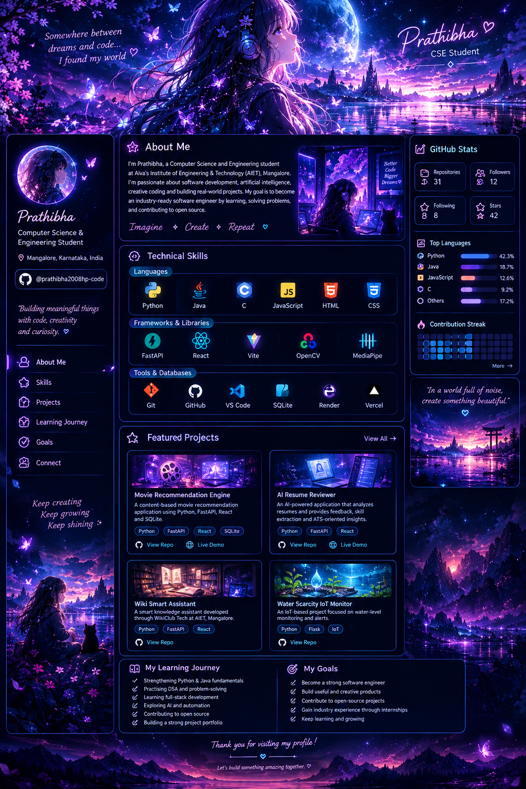

<!-- ═══════════════════════════════════════════════════════
     PRATHIBHA — ANIME COSMIC GITHUB PROFILE
     Theme: Dreamy Anime • Midnight Purple • Neon Cyan
════════════════════════════════════════════════════════ -->

 

---

<table>
<tr>
<td width="24%" valign="top">

# Prathibha

*Computer Science & Engineering Student*

📍 Mangalore, India

  

*"Building meaningful things with code, creativity and curiosity."*

---

### ✦ Navigation

- [About Me](#-about-me)
- [Technical Skills](#-technical-universe)
- [Projects](#-featured-projects)
- [Learning Journey](#-learning-journey)
- [My Goals](#-my-goals)
- [Connect](#-connect)

</td>

<td width="52%" valign="top">

## ✧ About Me

I'm Prathibha, a Computer Science and Engineering student at Alva's Institute of Engineering & Technology, Mangalore.

I enjoy software development, artificial intelligence, creative coding, and building real-world applications.

My goal is to become an industry-ready software engineer by strengthening my programming fundamentals, solving problems, and contributing to open source.

**Imagine ✦ Create ✦ Repeat**

---

## ✧ Technical Universe

**Languages**

**Frameworks & Libraries**

**Tools & Databases**

---

## ✧ Featured Projects

**Movie Recommendation Engine**

A content-based movie recommendation application using Python, FastAPI, React, TF-IDF and cosine similarity.

<a href="https://movie-recommendation-engine-mwo1.onrender.com">🌐 Live Demo</a>

 

**AI Resume Reviewer**

An AI-powered application for resume analysis, skill extraction, and ATS-oriented feedback.

<a href="https://ai-resume-reviewer1.vercel.app">🌐 Live Demo</a>

 

**Wiki Smart Assistant**

A knowledge assistant developed through WikiClub Tech at AIET, Mangalore.

 

**Water Scarcity IoT Monitor**

An IoT-based project focused on water-level monitoring and alerts.

</td>

<td width="24%" valign="top">

## ✧ GitHub Stats

  

## ✧ Top Languages

  

## ✧ Contribution Streak

</td>
</tr>
</table>

---

<table>
<tr>
<td width="50%" valign="top">

## ✧ Learning Journey

- Strengthening Python and Java fundamentals.
- Practising DSA and problem-solving.
- Learning full-stack development.
- Exploring AI and automation.
- Contributing to open source.
- Building a strong project portfolio.

</td>
<td width="50%" valign="top">

## ✧ My Goals

- Become a strong software engineer.
- Build useful and creative products.
- Gain industry experience.
- Contribute to open-source projects.
- Secure software engineering internships.
- Keep learning and growing.

</td>
</tr>
</table>

---

## 🌙 A Little Reminder

*In a world full of noise, create something beautiful.*

  

  

**Thanks for visiting my profile! ♡**

Let's build something amazing together.

